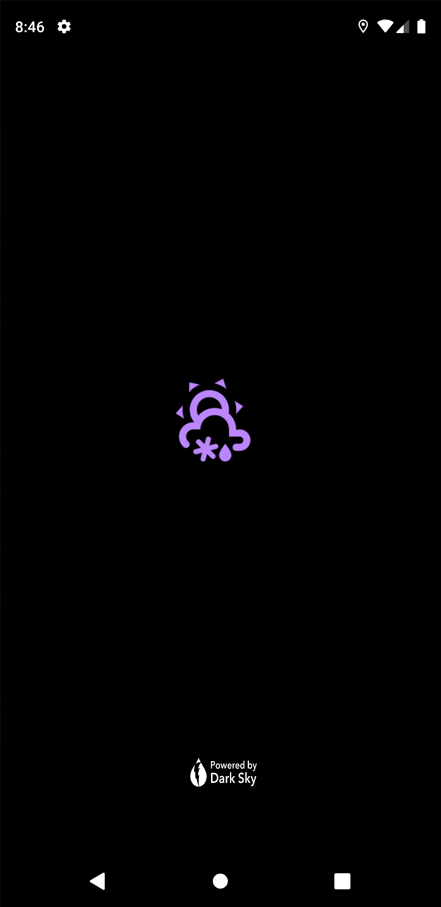
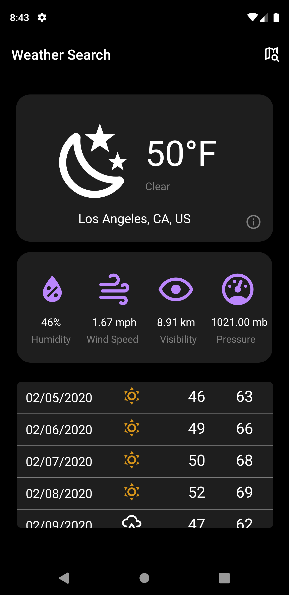
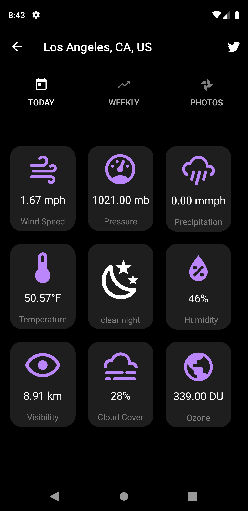
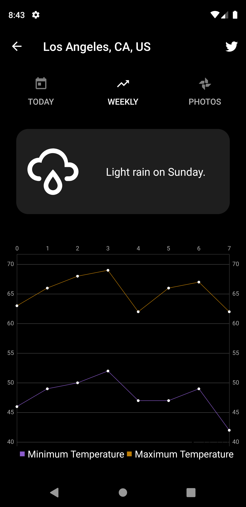

# weather-forecast-android-app

##Description
Android app implementing DarkSky and IP API to get weather forecast for current or searched location. 
Key features:
- Splash Screen Implementation
- Search ability with autocomplete feature
- Search location images
- Map weather forecast on weekly graphs using chart.js

##Screenshots

##Reference Solution
youtube.com/watch?v=jOkL1ILqZf0&t=24s
